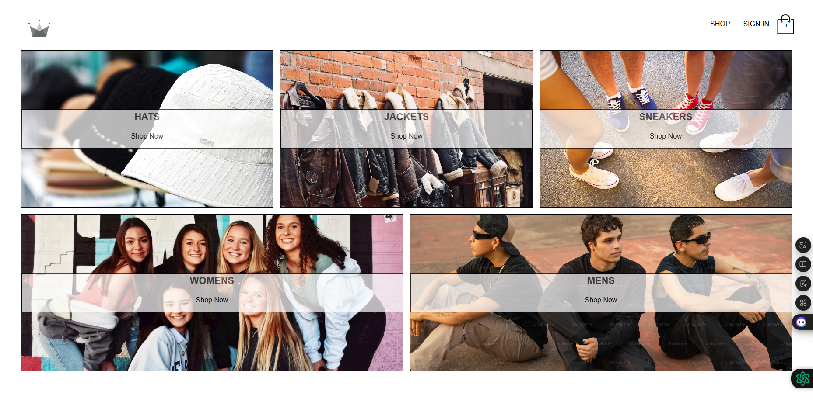
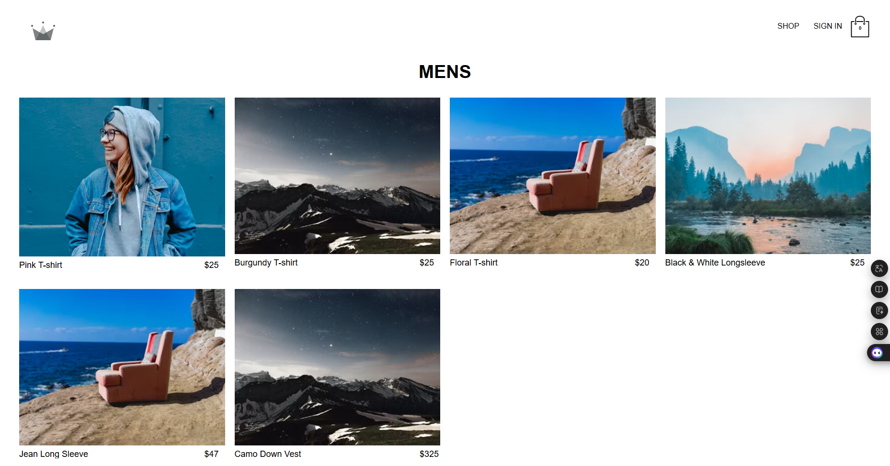
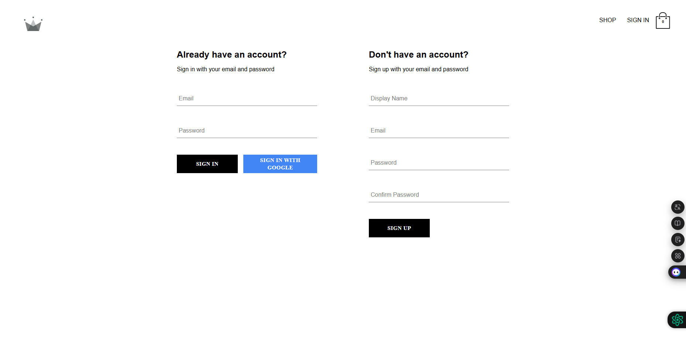
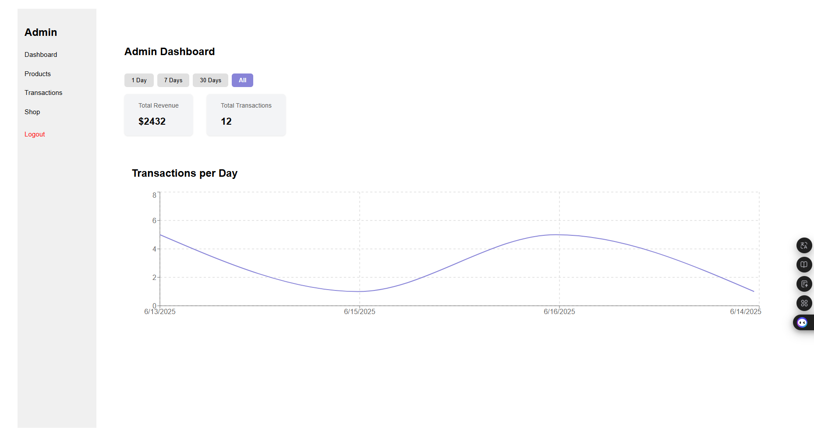
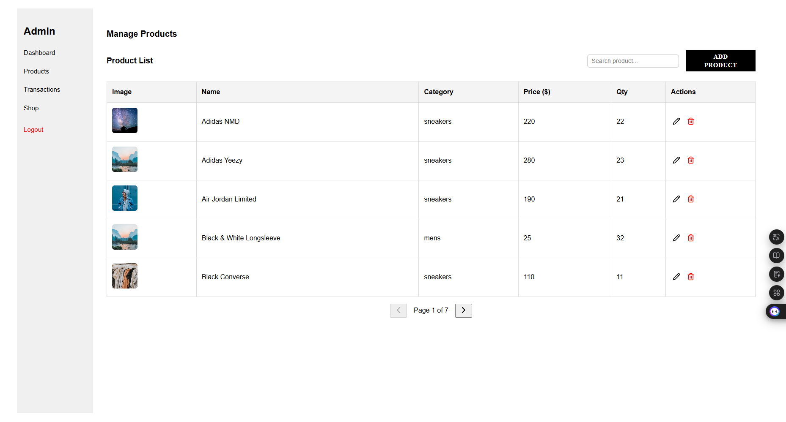

## 🛒 CRWN SHOP

**CRWN SHOP** adalah aplikasi **online shop pakaian** yang dibangun untuk **showcase portofolio dan pembelajaran fullstack menggunakan Firebase**.

**CRWN SHOP** is a **clothing e-commerce application** built to **showcase a portfolio and practice fullstack development using Firebase as the backend**.

---

### 🚀 Key Features | Fitur Utama

- ✨ **Login / Authentication** – Login dengan email & password atau magic link (Firebase Auth)
- ✨ **Product CRUD** – Tambah, edit, hapus produk dari dashboard admin
- ✨ **Shopping Cart & Checkout** – Tambahkan produk ke cart dan lakukan pembayaran dengan Stripe
- ✨ **Dashboard Chart** – Statistik transaksi harian, mingguan, dan bulanan via Recharts
- ✨ **Export Excel** – Unduh data transaksi sebagai file `.xlsx` menggunakan `xlsx` dan `file-saver`
- ✨ **Table Interaktif** – Menampilkan data dengan filter, sort, dan pagination menggunakan `@tanstack/react-table`

---

### 🛠️ Built With | Teknologi yang Digunakan

- [React.js](https://react.dev/)
- [Redux Toolkit](https://redux-toolkit.js.org/)
- [React Redux](https://react-redux.js.org/)
- [React Router v7](https://reactrouter.com/)
- [Firebase (Auth, Firestore)](https://firebase.google.com/)
- [Recharts](https://recharts.org/)
- [@tanstack/react-table](https://tanstack.com/table)
- [React Toastify](https://fkhadra.github.io/react-toastify/)
- [Lucide React](https://lucide.dev/)
- [Date-fns](https://date-fns.org/)
- [XLSX](https://github.com/SheetJS/sheetjs) + [FileSaver](https://github.com/eligrey/FileSaver.js)

---

### 📈 Demo

[Deploy Project](https://crwn-toko.netlify.app/)

## 🔑 Admin Login

Untuk mengakses dashboard admin, gunakan kredensial berikut:

```
Email: admin@gmail.com
Password: 12345678
```

---

### 🗼 Screenshots (UI)

_Tampilan antarmuka utama aplikasi:_







---

### ▶️ Run Locally | Jalankan Secara Lokal

```bash
git clone https://github.com/tiedsandi/project_crwn-store
cd project_crwn-store
npm install
npm run dev
```

---

### 🪕 Environment Variables | Variabel Lingkungan

Buat file `.env` di root project dan isi dengan konfigurasi berikut:

```
VITE_FIREBASE_API_KEY=your_firebase_api_key
VITE_FIREBASE_AUTH_DOMAIN=your_firebase_auth_domain
VITE_FIREBASE_PROJECT_ID=your_firebase_project_id
VITE_FIREBASE_STORAGE_BUCKET=your_firebase_storage_bucket
VITE_FIREBASE_MESSAGING_SENDER_ID=your_firebase_messaging_sender_id
VITE_FIREBASE_APP_ID=your_firebase_app_id
```

---

## 👋 Hi, I'm Fachran!

### 🚀 About Me | Tentang Saya

I'm a junior web developer based in Jakarta, Indonesia, with professional experience at Sinarmas Land and a portfolio of personal projects. I specialize in both front-end and back-end development using JavaScript, PHP, and various modern frameworks and tools.

Saya adalah web developer junior dari Jakarta dengan pengalaman profesional di Sinarmas Land serta berbagai proyek pribadi. Saya fokus pada pengembangan frontend & backend menggunakan JavaScript, PHP, dan berbagai framework modern.

### 🛠️ Skills | Keahlian

**Languages:** JavaScript, PHP, GO
**Frameworks:** React, Laravel, Node.js, Express
**DB/API:** MongoDB, PostgreSQL, MySQL, REST API, Firebase
**Tools:** Git, VS Code
**Soft Skills:** Teamwork, Problem-solving, Fast Learner
**Certifications:** BNSP – Junior Web Programmer (2025)

### 🔗 Links

[](https://fachran-sandi.netlify.app/)
[](https://www.linkedin.com/in/fachransandi/)
